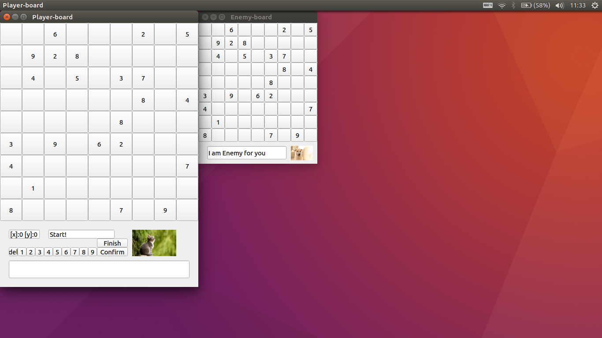

# Number place

## Python3

左側のplayer-boardに回答をつけて行きます
数字を埋め終わったら,finishボタンをクリックします.
confirmボタンをクリックすることで,あらかじめ与えられた問題と,自分が入力した箇所を比較することができます.
自分が入力した箇所は,緑色でマークアップされます.

## TODO
- [X] (RESET選択範囲)というボタンを作る
   -> Confirm buttonで代用
- [X] BaseとなるPlayerを作る
- [X] BaseとなるComputerを作る
- [ ] 並列化
- [ ] Computer 実装
- [ ] pyqt5 -> Tkinter

## Install

`sudo pip install pyqt5`

## thinking Code

[Prolog](https://en.wikipedia.org/wiki/Prolog)っぽく解いてみたい.

# 初級
[事実]
- マス目は9×9, 問題は与えられる.

[ルール]
- 縦横の９マスには同じものが入らない.
- 3×3の同じボックスには同じものが入らない.
- 1から9までの数字が入る.

# 中級
数独として解く
- 強制的にマスを埋める
- 双子
- Xウィング
- アリアドネの糸

# 上級
1つの正解を変換することにより,正解を導く

# 参考
[数独を数学する]:(http://www.seidosha.co.jp/book/index.php?id=2050)
